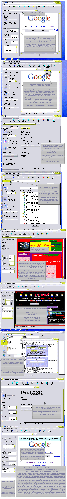



## KlanScape Web Browser 2\.1 \- Instant Filtering \(Popups, Content, Design\) new GUI, see Project Comment

### Description

This is a complete web browser with powerful features that give you full control over any webpage. It has the ability to protect your privacy, detect content, and extract any element from the page. It can filter websites based on the content that it finds using one of four powerful filter options. You can edit web pages in real-time and edit any active element on it; including replacing, deleting, and modifying attribute such as color. For example, clicking on a text box (form) on the page, in real-time, you can change its border style, colors, fonts, ect. It’s the features of a WYSIWYG web page editor, except that you are still on the page and can use the page. The built-in text editor used for viewing source code has tools like Find String Between and Does String Exist. You can control Popup Windows ( Popups ) different ways including ‘Ask Me’, ‘Block’, and ‘Allow’. New windows can open in my program instead of Internet Explorer. Detect active cookies and SSL Certificates. Control Download and JavaScript windows and block download requests. My browser includes an Alert Bar which covers top of screen to display important messages when needed. The browser is full featured and has a complete tool bar and panel. The panel can be shown or hidden to give the browser more space. Extract all links on a page into a list, and also show each part of the site in neat categories (treeview) including Links, Elements, Buttons (Inputs), and Images. Filter pages using different methods, and perform an action based on what is found on the site. For example, if anywhere on the site you find “at least 18” you can block the site. You can add HTML to each page you are viewing so that you can make a totally customized filter. You can have it redirect to another page based on what is found in the site. Give it a try, and please vote. The theme shown is for clarity and isn’t included. If you wish to help support my hard time put into this program, find out how you can show your thanks at the project’s official homepage http://www.klansoft.com/klanscape. I hope it helps you learn and be sure to provide me with comments on how I can make it better. Please vote if you like it! The screen shot isn’t included to save download time, so you may right-click it and save it or get it from the project official homepage.

[WARNING] THIS PROJECT IS COPYRIGHTED AND YOU MUST READ AND AGREE TO ALL INCLUDED TEXT FILES AND DOCUMENTATION. YOU MAY NOT USE ANY PART OF THIS SOURCE CODE, PROJECT, OR IDEAS WITHOUT PRIOR WRITTEN PERMISSION FROM JOSHUA DOUCETTE, THE AUTHOR OF THIS PROGRAM.
 
### More Info
 
Filter can sometimes slow down webpages if you are attempting too much on a huge site.

             |
---                |---
**Submitted On**   |2004-05-14 15:52:18
**By**             |[Josh Doucette](https://github.com/Planet-Source-Code/PSCIndex/blob/master/ByAuthor/josh-doucette.md)
**Level**          |Intermediate
**User Rating**    |4.8 (281 globes from 58 users)
**Compatibility**  |VB 5\.0, VB 6\.0
**Category**       |[Internet/ HTML](https://github.com/Planet-Source-Code/PSCIndex/blob/master/ByCategory/internet-html__1-34.md)
**World**          |[Visual Basic](https://github.com/Planet-Source-Code/PSCIndex/blob/master/ByWorld/visual-basic.md)
**Archive File**   |[KlanScape\_1745575142004\.zip](https://github.com/Planet-Source-Code/josh-doucette-klanscape-web-browser-2-1-instant-filtering-popups-content-design-new-gui-se__1-53670/archive/master.zip)

